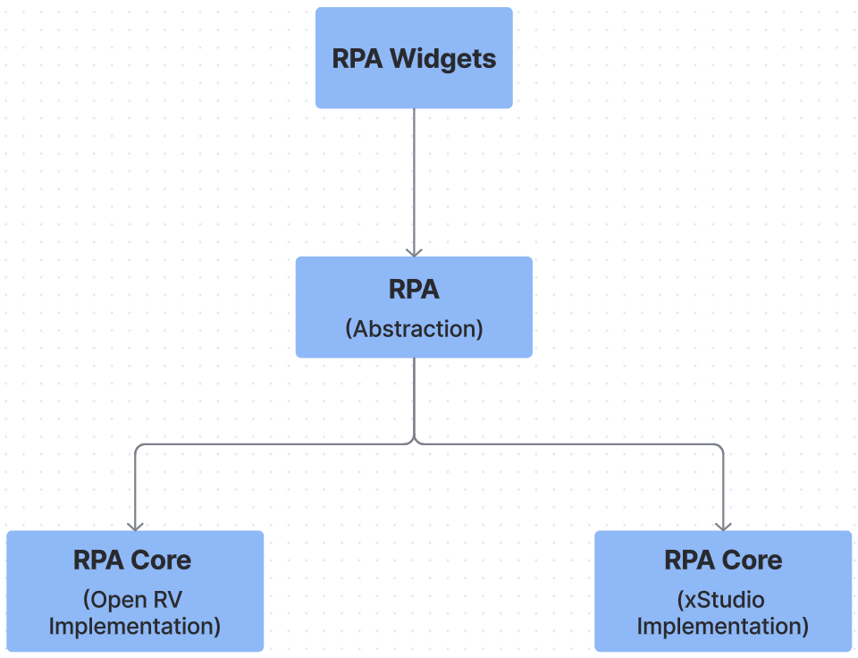
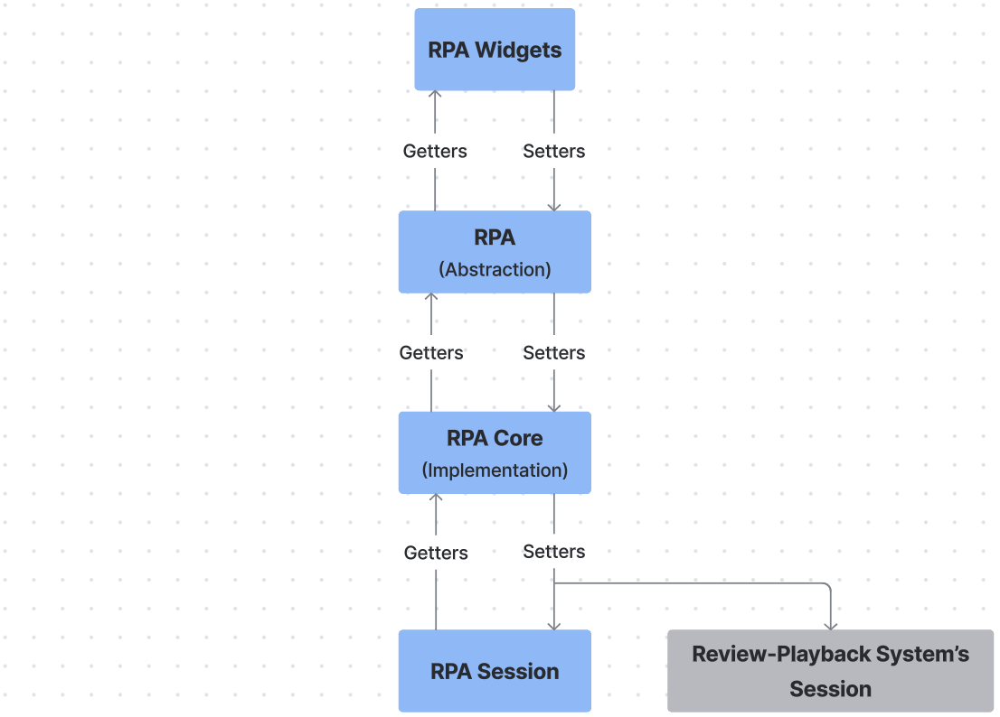
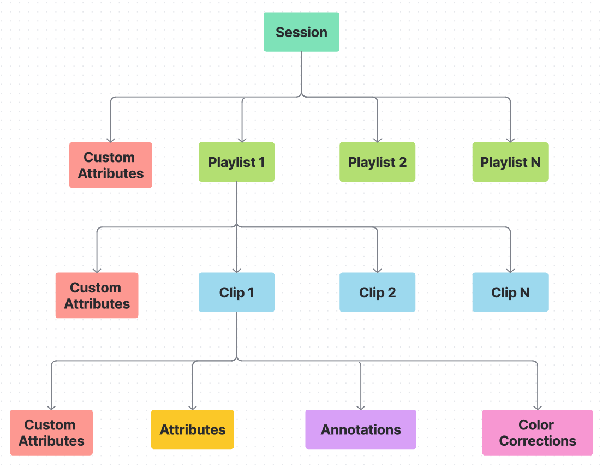

Introduction
============

.. contents::
   :local:
   :depth: 1

=================
What is this?
=================

This project ships two things that work together:

1. **RPA (Review Plugin API)** — a review-system-agnostic API for building
   review workflows and tools. RPA owns its own Session and delegates the
   actual playback work to whatever review system is plugged in underneath.
2. **The App** — a review product built on top of RPA. It hosts the UI,
   loads RPA-based plugins, and currently runs on **OpenRV** as its
   underlying review-playback system.

Plugins written against RPA never talk to the underlying review system
directly — they go through RPA, which keeps plugins portable across any
review system that provides an RPA implementation.

==========================
RPA in one paragraph
==========================

RPA is composed of **five API modules** plus a **delegate manager**:

* ``session_api`` — playlists, clips, clip attributes.
* ``annotation_api`` — strokes and text notes on clips.
* ``timeline_api`` — playback state, frame navigation, volume.
* ``color_api`` — color correction and color spaces.
* ``viewport_api`` — viewport transforms and overlays.

The **delegate manager** is how RPA plugs into a concrete review system.
Every RPA method is routed through a 4-tier pipeline (permission → pre →
core → post delegates). The *core* delegate is the review-system-specific
implementation — for this project, that's OpenRV. Extra pre/post delegates
are how plugins extend RPA without modifying core code.

See :doc:`rpa_api_modules/index` for the full API reference.

==========================
RPA owns its own Session
==========================

When a plugin creates playlists, clips, annotations, or color corrections,
RPA updates its own Session first — that Session is the source of truth.
The underlying review system is then synchronized to reflect it. This
means plugins only depend on RPA's model, not on any particular review
application's session format.

The Session model is inspired by **Sony Pictures Imageworks' Academy
SciTech Award-winning playback system, App**:

* A **Session** organizes work into Playlists.
* Each **Playlist** contains Clips (shots or media files).
* Each **Clip** carries attributes, annotations, and color corrections.

==========================
The App in one paragraph
==========================

The App provides its own ``AppMainWindow`` as the host for the review UI.
On startup it hides OpenRV's stock main window, re-parents OpenRV's
viewport into ``AppMainWindow``, and hands a **plugin manager** a list of
plugins to load. Each plugin receives the main window and an RPA instance
and builds its UI on top of RPA.

See :doc:`app` for the App architecture and plugin contract, and
:doc:`open_rv_implementation` for how the OpenRV review-system glue is
wired up.
