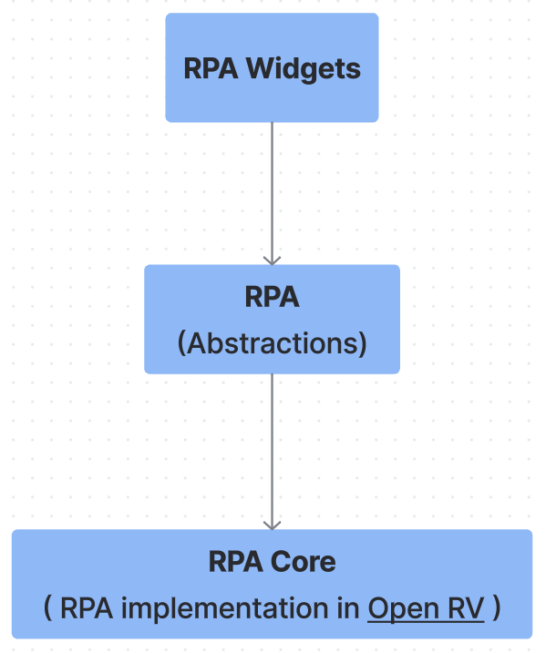
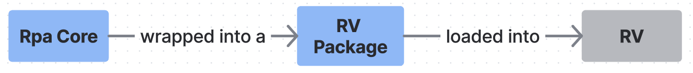
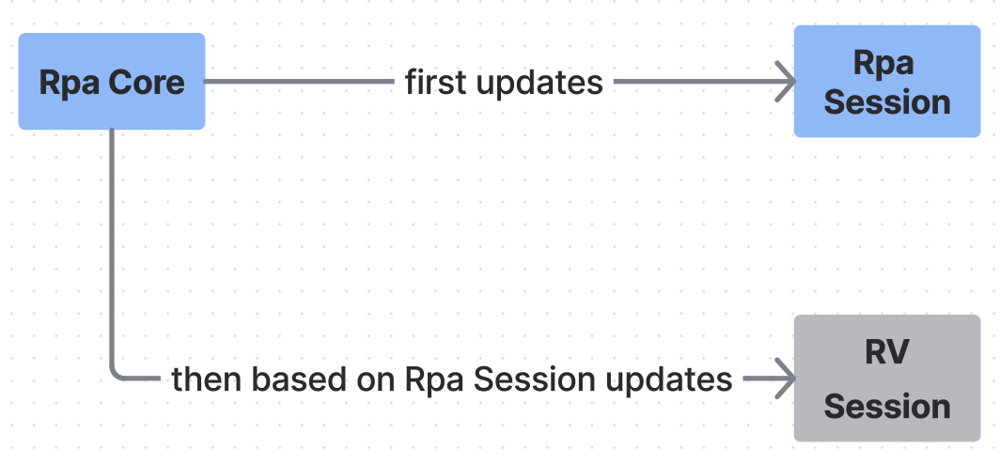
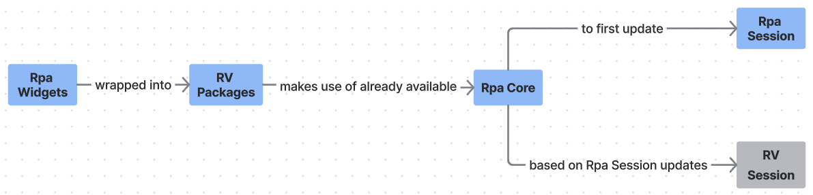

OpenRV Implementation
=====================

.. contents::
   :local:
   :depth: 1

========
Overview
========

OpenRV is the underlying review-playback system the App currently runs
on. The integration lives in two RV packages built by
``rpa/dev_setup.py``:

1. ``./open_rv/pkgs/rpa_core_pkg/rpa_core_mode.py`` — installs the OpenRV
   implementation of RPA (the "core delegate").
2. ``./open_rv/pkgs/rpa_widgets_pkg/rpa_widgets_mode.py`` — on
   ``session-initialized``, replaces OpenRV's UI with the App and loads
   plugins.

For how to build these packages and launch the App, see
:doc:`build_and_launch`.

=============================
RPA Core — RV Package
=============================

Located at **./open_rv/pkgs/rpa_core_pkg/rpa_core_mode.py**.

RPA itself is a collection of abstractions (the five API modules). To be
useful, those abstractions need a concrete implementation that drives an
actual review player. That implementation is called **RPA Core**. For
OpenRV, RPA Core is delivered as an RV package.

The RPA session is the source of truth. Updates flow **RPA session →
RV session**: RPA session state is updated first, and the RV session is
synchronized to reflect it.

The RPA Core instance is attached to the Qt ``QApplication`` so the
second RV package (below) can retrieve it:

.. code-block:: python

   app = QtWidgets.QApplication.instance()
   app.rpa_core = self.__rpa_core

================================
RPA Widgets — RV Package
================================

Located at **./open_rv/pkgs/rpa_widgets_pkg/rpa_widgets_mode.py**.

On OpenRV's ``session-initialized`` event, ``RpaWidgetsMode`` bootstraps
the App and takes over the window entirely. There is no opt-in / opt-out
menu — OpenRV's stock UI is replaced by ``AppMainWindow``, which hosts
OpenRV's viewport and every plugin's widget.

Bootstrap sequence
------------------

1. Locate OpenRV's main window via ``rv.qtutils.sessionWindow()`` and its
   viewport widget by ``objectName="no session"`` (set in OpenRV's
   ``GLView`` constructor). The viewport lookup asserts loudly so a
   rename in a future OpenRV release fails fast instead of silently
   producing a black window.
2. **Hide — do not delete** — OpenRV's main window. ``GLView`` holds a raw
   C++ pointer (``m_doc``) to ``RvDocument``; destroying the stock window
   would dangle that pointer and crash on the next render. Hiding is
   enough to strip OpenRV's menus, toolbars, and hotkeys from the visible
   UI.
3. Create shared ``QSettings(org="imageworks.com", app="rpa_app")`` and
   logger instances. Both are reused by the App and the RPA instance so
   they write to the same on-disk settings file and the same log file.
4. Construct ``AppMainWindow(viewport_widget, settings, logger)``. It
   re-parents OpenRV's viewport into itself and owns the menu bar, layout
   persistence, dark title bar, fullscreen toggle, and the ``get_*_menu``
   accessors plugins use.
5. Apply App styling to the ``QApplication``, construct ``Rpa(settings,
   logger)``, wire core delegates via
   ``default_connection_maker.set_core_delegates_for_all_rpa``, hand the
   viewport to ``rpa_core.viewport_api._set_viewport_widget``, and install
   ``ViewportUserInputRx`` on the viewport.
6. Initialize the plugin manager with the ``AppMainWindow``, the RPA
   instance, the ``DbidMapper``, and the viewport input receiver, then
   ``show()`` the main window.

Plugin loading
--------------

The plugin set is listed in ``rpa/plugins/open_app_plugins.cfg``. The
plugin contract (``app_init(self, app)`` / ``post_app_init(self)``,
``<plugin>.json`` metadata, etc.) is documented in :doc:`app`. Plugins
use RPA to manipulate the session and parent their widgets to
``AppMainWindow`` — they never talk to OpenRV directly.

Shutdown
--------

When the user closes ``AppMainWindow``, it emits ``SIG_CLOSED``.
``RpaWidgetsMode`` responds by closing the hidden ``RvDocument`` so
OpenRV's ``before-session-deletion`` handler runs in
``RvDocument::closeEvent``; after that Qt's ``quitOnLastWindowClosed``
takes the process down. The App is deliberately OpenRV-agnostic — this
RV-specific shutdown glue lives in the RV package, not in
``AppMainWindow``.

-------------------------------
Wiring RPA to OpenRV in code
-------------------------------

Two pieces are needed to run the App on OpenRV:

1. An ``Rpa`` instance with OpenRV's ``RpaCore`` attached as its core
   delegate.
2. The OpenRV viewport widget, which ``AppMainWindow`` hosts.

``RpaWidgetsMode`` does this roughly as follows:

.. code-block:: python

   from rpa.rpa import Rpa
   from rpa.open_rv.rpa_core.default_connection_maker import \
       set_core_delegates_for_all_rpa

   rv_main_window = rv.qtutils.sessionWindow()
   app_qt = QtWidgets.QApplication.instance()
   rpa_core = app_qt.rpa_core  # installed by the rpa_core RV package

   rpa = Rpa(settings, logger)
   set_core_delegates_for_all_rpa(rpa, rpa_core)

After that, ``AppMainWindow`` is constructed around OpenRV's viewport
widget, the plugin manager is initialized with ``AppMainWindow`` and
``rpa``, and every plugin receives them via ``app_init(self, app)``.

=================
Media Attribution
=================

Documentation includes clips/screenshots from *Big Buck Bunny* by the Blender Foundation, licensed under `CC BY 3.0 <https://creativecommons.org/licenses/by/3.0/>`_.
Source: https://peach.blender.org/
